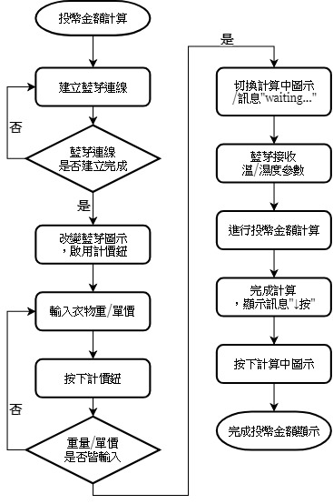
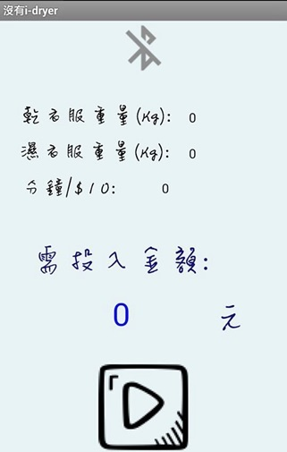
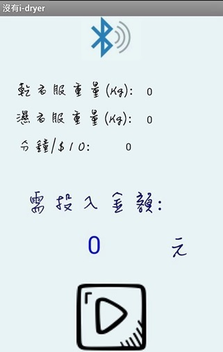
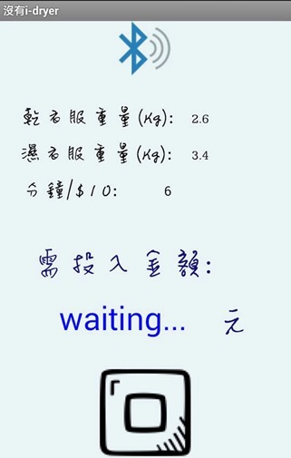
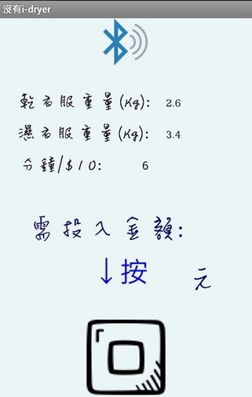
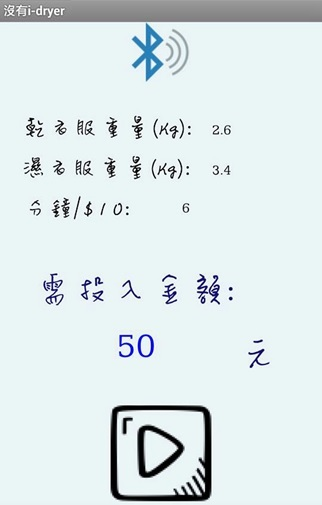

# 自助投幣式烘衣機估算價位偵測

烘衣機每一次放入的衣物量和洗滌物厚薄都不同。像是在自助式洗衣店洗完衣服需要烘衣時，我們往往無法得知確切的烘衣時間，都是憑藉以前印象去決定烘幾分鐘，導致有時候根本沒乾即停止，或是早就乾了還在運轉，不僅花了更多時間來回確認也浪費金錢。

## 流程

## 硬體端

* Arduino UNO
* DHT22模組 數位溫濕度感測器 Arduino套件
* HC-05 藍芽模組

硬體端負責接收/發送溫溼度感測訊號，由App端進行計算。

## App端

* 藍芽連線

|初始畫面|藍芽連線完成|
|:--:|:--:|
|||
|中央上方圖示代表藍芽尚未 連接，點選藍芽圖示進行連線|連線完成後藍芽圖示變更，並 激活計價鈕|

* 開始執行與等待回應

|計算中|完成計算|
|:--:|:--:|
|||
|按鈕後，顯示處理中訊息，等待 接收參數以完成計算|計算完成|

* 完成

|投幣金額計算結果|
|:--:|
||
|顯示結果，回報所需投入金額|
